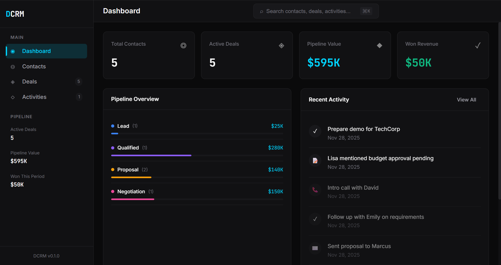

# DCRM - Dirmacs CRM



A minimal, efficient customer relationship manager built with Rust and Dioxus.

<p align="center">
  
  
  
</p>

## Philosophy

> "Cut the noise. Maximize efficiency."

DCRM reimagines what a CRM should be. Instead of a bloated behemoth with features you'll never use, DCRM provides a focused, minimal toolset that covers what actually matters:

- **Contacts** - Your people, organized
- **Deals** - Your pipeline, visualized
- **Activities** - Your interactions, tracked
- **Dashboard** - Your KPIs, at a glance

That's it. No marketing automation. No social media integrations. No AI-powered-blockchain-synergy. Just the essentials, done well.

## Features

### Contact Management
- Full contact profiles with company, position, tags
- Quick search across all contacts
- Activity history per contact
- Deal associations

### Deal Pipeline
- Visual Kanban-style board
- Drag-and-drop stage progression
- Pipeline value tracking
- Weighted probability forecasting

### Activity Tracking
- Tasks, calls, emails, meetings, notes
- Filter by type or completion status
- Link activities to contacts and deals
- Quick task completion

### Dashboard
- Pipeline overview
- Recent activity feed
- Pending tasks
- Key metrics at a glance

## Tech Stack

- **Rust** - Memory-safe, blazingly fast
- **Dioxus 0.6** - React-like UI framework for Rust
- **WebView** - Native desktop rendering (< 5MB binary)
- **Local Storage** - JSON-based persistence

## Installation

### Prerequisites

- [Rust](https://rustup.rs/) (stable toolchain)
- [Dioxus CLI](https://dioxuslabs.com/learn/0.6/getting_started)

```bash
# Install Rust (if not already installed)
curl --proto '=https' --tlsv1.2 -sSf https://sh.rustup.rs | sh

# Install cargo-binstall for faster CLI installation
cargo install cargo-binstall

# Install Dioxus CLI
cargo binstall dioxus-cli
```

### Linux Dependencies

```bash
# Ubuntu/Debian
sudo apt install libwebkit2gtk-4.1-dev libgtk-3-dev libappindicator3-dev

# Fedora
sudo dnf install gtk3-devel webkit2gtk4.1-devel libappindicator-gtk3-devel
```

### Build & Run

```bash
# Clone the repository
cd dcrm

# Development mode with hot-reload
dx serve

# Build for release
dx build --release

# Bundle for distribution
dx bundle --release
```

## Project Structure

```
dcrm/
├── Cargo.toml          # Dependencies
├── Dioxus.toml         # Dioxus configuration
├── assets/
│   └── main.css        # Styles
└── src/
    ├── main.rs         # Application entry point
    ├── models/         # Data models (Contact, Deal, Activity)
    ├── state/          # State management & actions
    ├── components/     # Reusable UI components
    └── pages/          # Page components
```

## Data Storage

DCRM stores data locally in JSON format:

- **Linux**: `~/.local/share/dcrm/data.json`
- **macOS**: `~/Library/Application Support/dcrm/data.json`
- **Windows**: `%APPDATA%\dcrm\data.json`

## Keyboard Shortcuts

| Shortcut | Action |
|----------|--------|
| `⌘/Ctrl + K` | Open search |
| `Escape` | Close modal/search |

## Design System

DCRM uses an industrial minimal design language:

- **Background**: Deep blacks (#0a0a0b)
- **Accent**: Electric cyan (#00d4ff)
- **Typography**: JetBrains Mono (data) + Inter (UI)
- **Borders**: Subtle zinc grays

## Roadmap

- [ ] Data import/export (CSV)
- [ ] Keyboard navigation
- [ ] Dark/Light theme toggle
- [ ] Multiple pipelines
- [ ] Contact merging
- [ ] Undo/Redo

## Contributing

Contributions are welcome! Please feel free to submit a Pull Request.

## License

MIT License - see [LICENSE](LICENSE) for details.

---

Built with ❤️ by [Dirmacs](https://dirmacs.com)
